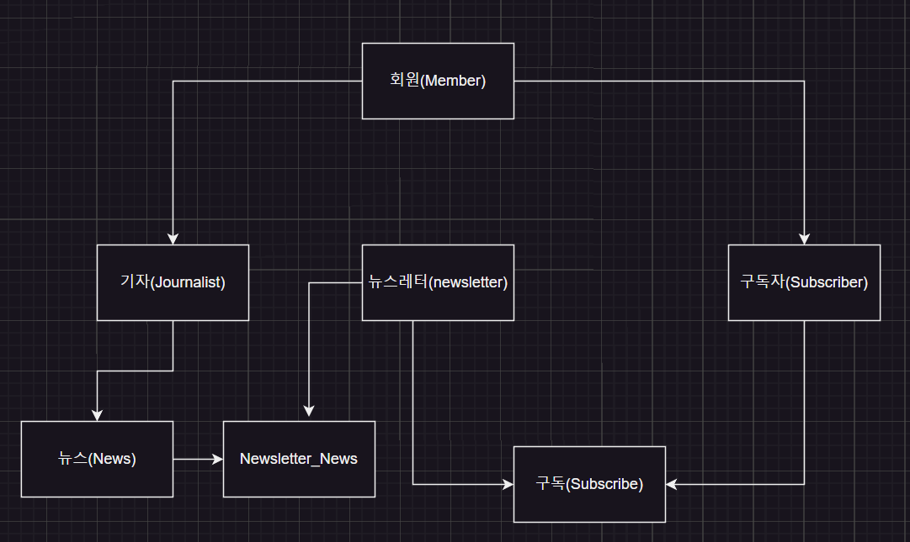

## newsletter 도메인 모델

## 도메인
- 뉴스를 게시하고, 게시된 뉴스를 읽을 수 있는 서비스
- 뉴스를 보기 위해서는 회원이 뉴스를 구독하고 있어야 합니다.
  - 구독한 회원이 아니여도 뉴스레터의 정보를 알 수 있습니다.
  - 회원가입시 이메일인증 해야하며 이메일 인증 완료 시, 가입이 완료됩니다.
  - 가입한 회원이 뉴스레터에 구독권을 신청하면 해당 뉴스테러를 구독 할 수 있습니다.
  - 뉴스레터는 정기적으로 메일로 전달됩니다.
  - 가입한 회원은 본인의 프로필을 수정할 수 있습니다. (별명, )
- 뉴스를 제공하는 기자와 뉴스를 읽을수 있는 회원으로 나뉩니다.
  - 회원은 기자와 구독자가 될 수 있습니다. 
  - 회원은 뉴스를 작성 할 수 없습니다.
  - 기자는 뉴스를 작성 할 수 있습니다.
- 구독자는 뉴스레터를 구독합니다.
  - 구독자가 구독한 뉴스레터 카테고리와 연관된
  - 구독자는 뉴스에 코멘트를 남길 수 있습니다. 
  - 가장 많이 구독한 뉴스테러 top 10을 조회할 수 있으며, 한시간마다 top 10이 갱신됩니다.
- 기자는 기사와 뉴스레터를 작성합니다.
  - 기자는 특정 카테고리에 맞는 뉴스레터를 작성할 수 있으며, 뉴스레터와 연관된 뉴스를 작성 할 수 있습니다.
  - 기자는 본인이 작성한 뉴스를 수정할 수 있습니다.

## 도메인 모델

### 회원
_Aggregate Root_

#### 속성
- `id` 
- `email`: 이메일 (ID)
- `password` : 패스워드
- `nickname` : 별명
- `status` : 회원 상태 (PENDING, ACTIVE, DEACTIVATED)
- `userRole` : 구독 모델 (NOT_SUBSCRIBE, NORMAL, VIP)
- `registeredAt` : 등록 일시
- `activatedAt` : 등록 완료 일시
- `deactivatedAt` : 탈퇴 일시
- `emailVerifiedAt` : 이메일 인증일자

#### 행위
- `verifyEmail()` : 이메일 인증
- `deactivate()` : 탈퇴

### 기자 (Journalist)
_Entity_
기사를 작성

### 구독자 (subscriber)
_Entity_
뉴스레터를 구독

### 뉴스 (News)
_AggregateRoot_
뉴스레터에 포함할 뉴스 

### 뉴스레터 (NewsLetter)
_AggregateRoot_
뉴스의 구독 모델